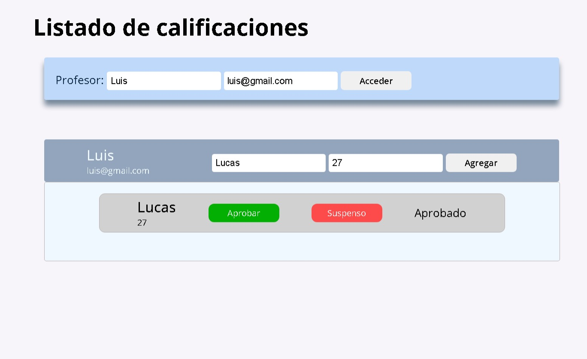

# Listado de calificaciones - Enlace hacia la aplicación

Aplicación para gestionar las calificaciones de los supuestos estudiantes.

## Tabla de contenidos

- [Resumen](#resumen)
  - [La Aplicaión](#la-aplicacion)
  - [Screenshot](#screenshot)
  - [Links](#links)
- [Mi proceso](#mi-proceso)
  - [Paso a paso](#paso-a-paso)
  - [¿Qué he aprendido?](#que-he-aprendido)
  - [Algunos detalles](#algunos-detalles)
  - [Recursos útiles](#recursos-utiles)
- [Auto](#autor)
- [Reconocimientos](#reconocimientos)

## Resumen

### La Aplicación

Los usuarios('los profesores') podrán ser capaces de:

- Registrarse en el formulario mediante su nombre e identificador, en este caso, su email.

- Una vez registrados de forma correcta, a continuación de manera dinámica pueden ingresar el nombre y edad de sus alumnos y calificar sus resultados.

### Screenshot

### Links

- Live Site URL: (https://sistema-de-calificaciones.netlify.app/)

## Mi proceso

### Paso a paso:

- Estructura HTML5
- Personalizar las varibales en CSS
- Flexbox
- Creación de la clase Estudiante
- Crear la clase Profesor mediante la herencia de Estudiante
- Crear la clase Profesor mediante la herencia de Estudiante
- Recoger los valores de entrada del formulario con FormData()
- Delegación de eventos desde el DOM con 'matches()' y 'dataset'

### Que he aprendido

En este proyecto he puesto en práctica todo lo que llevo aprendido de Javascript mediante la programación orientada a objetos. Aunque puede que no sea necesario crear clases para cada objeto, en este caso, para los profesores y estudiantes, la idea final es comenzar a modelar cosas en ambitos del mundo real.

Para poder entender toda la lógica del código de JavaScript, es necesario mirar el siguiente 'snippet' creado del elemento HTML:

"Template in HTML": {
    "prefix": "template",
    "body": ["<template>$1</template>"],
    "description": "Agrega el template en html"
}

### Algunos detalles

'Template' es un mecanismo para mantener el contenido HTML del lado del cliente que no se renderiza cuando se carga una página, pero que posteriormente puede ser instanciado durante el tiempo de ejecución empleando JavaScript.

En resumen, con 'template' podemos evitarnos el usar 'innerHTML' y generar 'Reflow' o tener que crear cada elemento HTML con 'createElement()'.

### Recursos utiles

- [Template recurso 1](https://developer.mozilla.org/en-US/docs/Web/HTML/Element/template#avoiding_documentfragment_pitfall) - Documentación de modzilla para entender más acerca de los 'template'.
- [Fragment recurso 2](https://developer.mozilla.org/en-US/docs/Web/API/DocumentFragment) - Documentación de modzilla acerca del 'DocumentFragment'.

## Autor

- Website - [Lucas Todarello](https://lucas-todarello-portfolio.netlify.app/)

